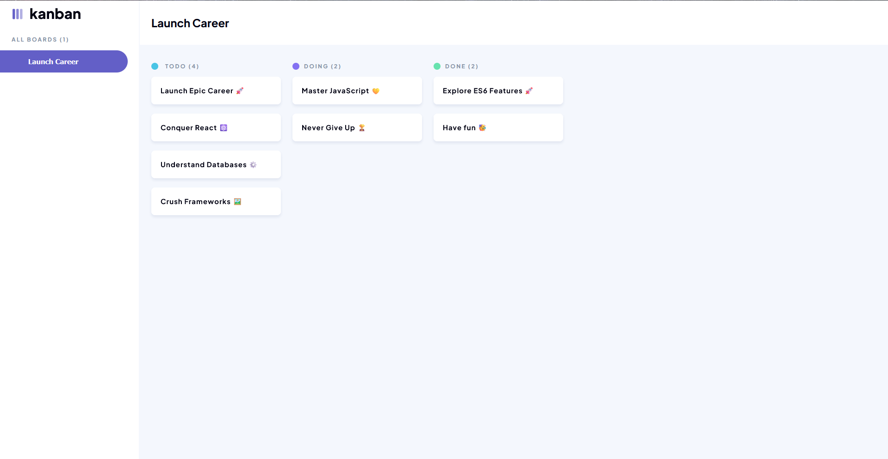
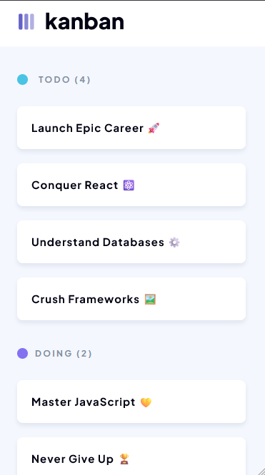
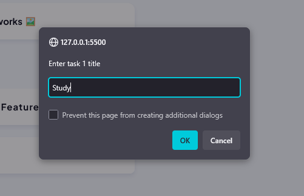
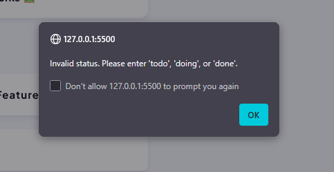
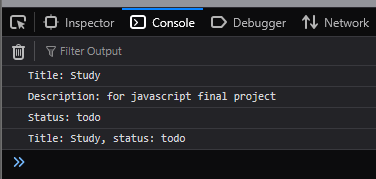
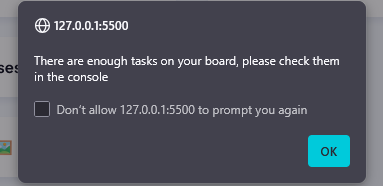
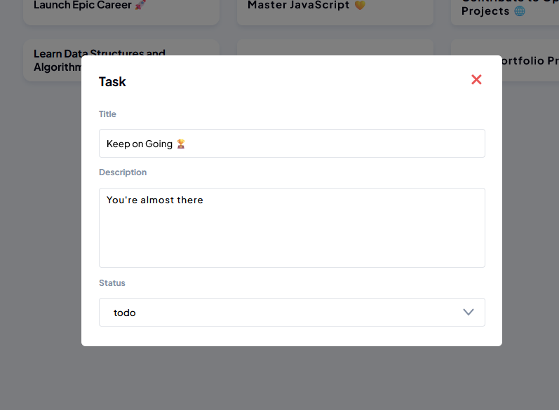
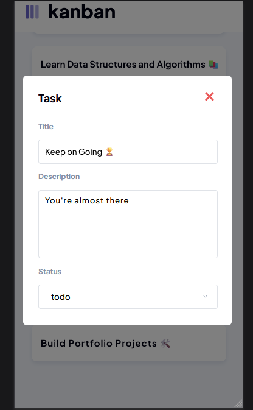
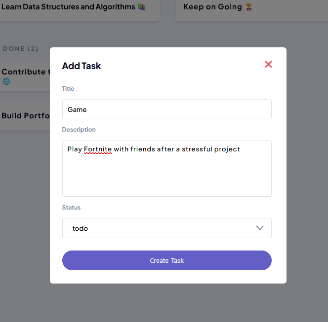
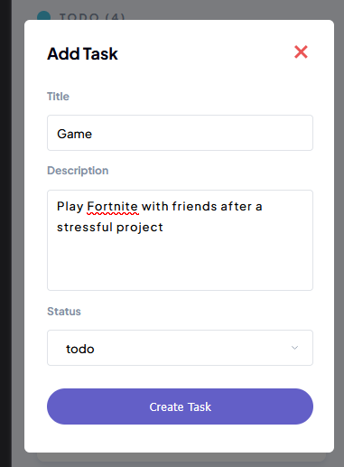

# Responsive Kanban Board

A visually accurate and fully responsive **Kanban board** built to replicate the provided Figma design.  
The application features multiple task columns, styled task cards, and a static side panel for a professional and cohesive user experience.

---

## 🚀 Features

- **Custom Branding**
  - Favicon and page title match the application’s theme.
- **Kanban Board Layout**
  - Multiple columns (e.g., *To Do*, *In Progress*, *Done*) following the exact Figma layout.
- **Pixel-Perfect Styling**
  - Colours, typography, spacing, and shadows match Figma specifications.
- **Fully Responsive**
  - Adapts seamlessly between desktop and mobile views as per Figma’s responsive design.
- **Task Cards**
  - Styled cards with clear titles, borders, padding, and shadows for easy readability.  
  - **Hover effects and transitions** for smooth and engaging interactivity.
- **Static Side Panel**
  - Contains correct icons, text, and branding elements, structured for a polished look.

---

## 📱 Responsiveness

- **Desktop/Laptop** → Full Kanban board with side panel.
- **Mobile** → Compact design that maintains usability and readability.

---

## 2. JavaScript Task Entry System

A JavaScript-based system that allows users to input three tasks with full details while ensuring data validation and consistency.

### Features
- Prompt users to enter **title**, **description**, and **status** for two tasks
- Automatically converts status input to **lowercase**
- Validates status to accept only `todo`, `doing`, or `done`, prompting repeatedly until valid
- Displays **completed tasks** (status: `done`) in the console
- Shows a motivational message if no tasks are completed:  
  `"No tasks completed, let's get to work!"`  
- Assigns **unique incremental IDs** to each task
- Alerts users when the **last allowed task** is added

---

## 3. Dynamic Task Board

A modular JavaScript-powered Kanban board where tasks are dynamically created from initial data, automatically placed in the correct columns, and can be viewed or edited via a responsive modal.

### Features
- Tasks are rendered from initial data using JavaScript, placed into the correct columns based on their status. 
- Clicking a task opens a modal with editable **title**, **description**, and **status** 
- Modal is fully responsive for mobile devices.
- Modular JavaScript functions improve maintainability. 

### How it works
- Tasks are dynamically created from an initial array using JavaScript functions.
- Each task is appended to the correct column (`todo`, `doing`, `done`) using a modular function. 
- Clicking a task opens a modal that displays the task’s title, description, and status.
- The modal allows users to edit task details and is fully responsive for mobile devices. 

### How to Use
1. Open `index.html` in your browser  
2. View tasks in their respective columns  
3. Click on any task to open the modal  
4. Edit the title, description, or status in the modal  
5. Close the modal by clicking the “X” button 

---

## 4. Task Board With Local Storage Persistence And Task Creation  

"Task board with local storage; add and categorize tasks in To Do, Doing, Done columns via a modal."

### Features 
- **Persistent Tasks:** Tasks are saved in local storage, so they remain after refreshing or reopening the page.
- **Add Task Modal:** Click the **Add Task** button to open a modal where you can input task details.
- **Task Form:** Enter task title, description, and select status from a dropdown.
- **Immediate Rendering:** New tasks appear on the board immediately after submission.
- **Responsive Design:** Modal and task board adapt seamlessly to both desktop and mobile screens.
- **Modular Code:** JavaScript is split into modules, each handling a single responsibility (local storage, task rendering, modal management).

### How to use
- Click Add Task to open the modal.
- Fill in the task title, description, and select a status.
- Submit to add the task to the board.
- Tasks remain saved and organized even after refreshing the page.

## 🛠️ Tech Stack

- **HTML**  
- **CSS** 
- **JavaScript**  
- **LocalStorage API**
---

## 📸 Kanban Board Preview

### Desktop View

### Mobile View

---

## 📷 Javascript task entry system preview  

### User Input View  

### Invalid Status  

### Console Log Output  

### Task Limit Alert
  

### console array output

---

## 📸 Dynamic Task Board Modal Overview  

### Desktop View

### Mobile View

## 📸 Task Board With Local Storage Persistence And Task Creation Overview

### Desktop Task Input Modal  
 

### Mobile Task Input Modal  
;

### Displayed Task View  
;